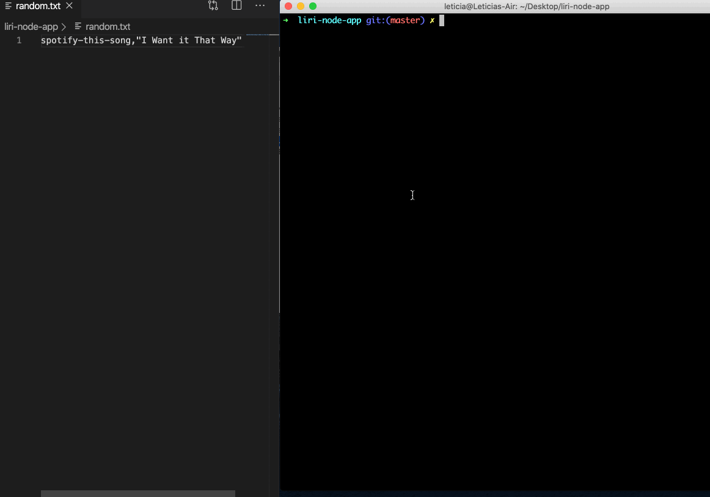
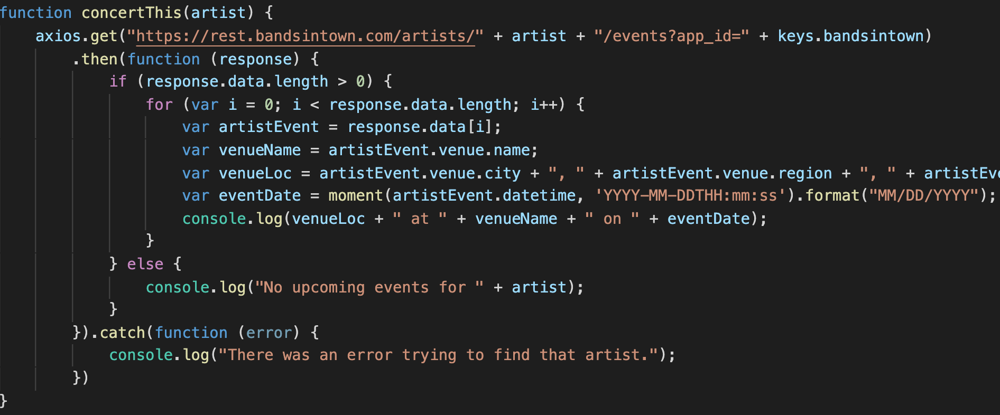
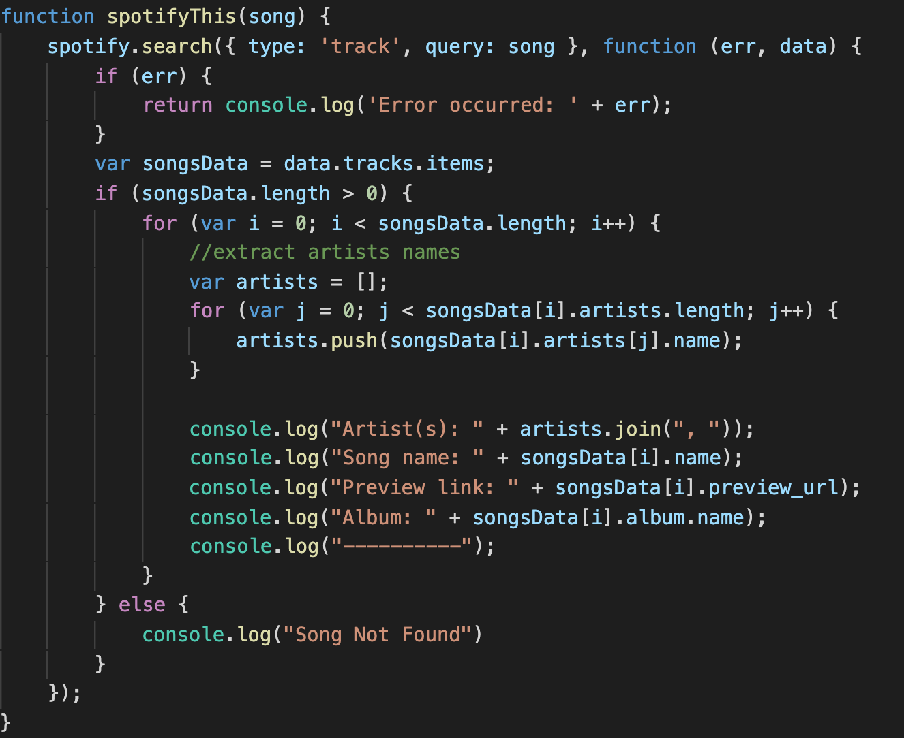

# Liri Node App

LIRI is a *Language Interpretation and Recognition Interface*, i.e. a command line node app that takes in parameters (via command line arguments) and gives back the requested data. LIRI will search Spotify for songs, Bands in Town for concerts, and OMDB for movies, using Axios to grab data from the respective APIs.

## Technologies used

* JavaScript
* Node.js
* Node packages:
  * Node-Spotify-API
  * Axios
  * Moment
  * DotEnv

## User Flow GIFs

Searching the **Bands in Town Artist Events** API for an artist to see upcoming events:

Searching the **OMDB** API for information about any given movie. If the user doesn't type a movie in, the program will output data for the movie 'Mr. Nobody.':

Searching **Spotify** for a song. If no song is provided, LIRI will default to "The Sign" by Ace of Base.:

When using this particular command, LIRI will take the text inside of our 'random.txt' file and then use it to call one of LIRI's pre-defined commands:

## Essential Code
Code to send requests using the axios package to the Bands In Town API:

Using the node-spotify-api package to retrieve song information from the Spotify API:

